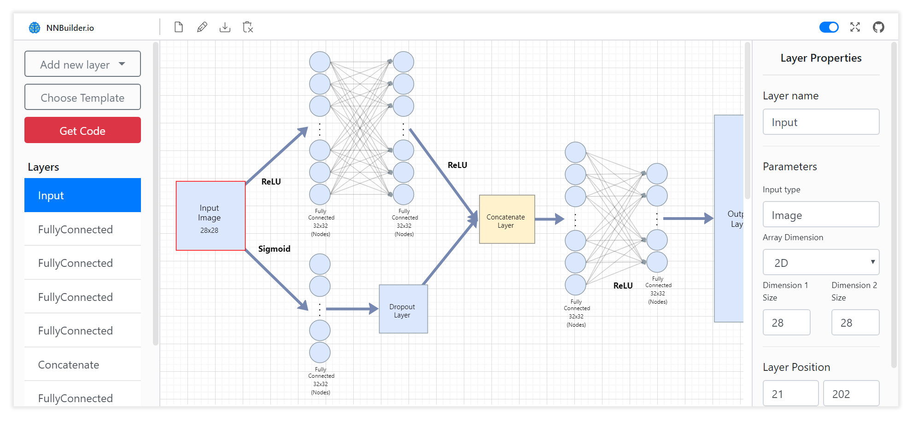

## NNBuilder.io

A user interface that allows you to easily modify and visualize varios neural network architectures.

<p align="center">
	<a title="Click to watch a demo" href="https://nnbuilder.io"></a>
</p>

A link to the website: [NNBuilder.io](https://nnbuilder.io)

### More about this website

Deep neural networks can be hard to understand, and notoriously difficult to plan and modify.

I built a user interface website using React.JS that allows you to easily visualize and make modifications in neural network architectures.

Furthermore, it provides access to code generation which isn't so trivial task itself, sequential models might be easy to implement, but models with arbitrary branching and merging are less so. Therefore, many reductions to graph-like structures have been taken and algorithms that use those reductions.

Some of the visual parts were also non-trivial to code, and analytical geometry and trigonometric functions were widely used to overcome these obstacles.

### Installation and Prerequisites

1. An adequate version of Node.js is installed. Here's the one I use:
```
node --version
V12.16.1
```

2. An adequate version of `npm` is installed. Here's the one I use:
```
$ npm --version
6.13.4
```

3. A GitHub account. :octocat:
4. Clone this repository to your computer.
5. Install the project dependencies by running `npm install` from the project's directory.
6. Run the project by running `npm start`

### Contribution
Feel free to suggest, report bugs and add forked ideas to this project.
